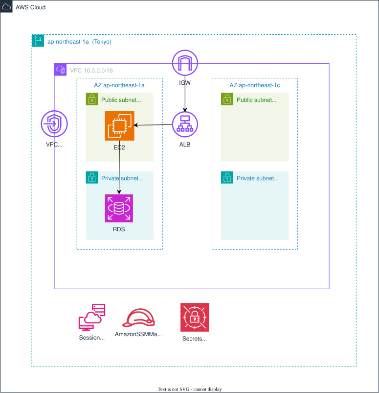

# AWS_Study_CloudFormation
awsでSpringBootアプリのインフラ環境を構築します

## 1. システム構成図 (Architecture)


## 2. 構築される主要リソース (Resources)
このテンプレートによって、以下のAWSリソースが構築されます

- **Network:** VPC (10.0.0.0/16), Public/Private Subnets, Internet Gateway VPCEndPoint (S3 Gateway)
- **Compute:** Amazon EC2 (SessionManagerでのログイン)
- **Database:** Amazon RDS (MySQL Multi-AZ)
- **RoadBalancer:** Application LoadBalancer
- **Security:** IAM Roles(EC2にSSMでログイン,RDSの拡張モニタリング有効化の設定), Security Groups(EC2 RDS ALB) Secrets Manager(DBログインパスワード管理) 

## 3. 前提条件 (Prerequisites)
スタックの作成を実行する前に、以下の準備が必要です。

* **アクセス権限:** `AdministratorAccess` または該当リソースの作成権限を持つIAMロール/ユーザー
* （現場でコンソール画面の操作権限がない方）**AWS CLI:** バージョン 2.x 以上

## 4. AWS CLIの操作実行例
AWS CLIを使用してスタックの作成を行うコマンド例です。

```
# スタックの作成・更新
aws cloudformation deploy \
  --template-file <テンプレートファイル名>.yml \
  --stack-name <スタック名> \
  --parameter-overrides EnvType=dev DBPassword=YourSecurePassword \ # パラメータを上書きする場合
  --capabilities CAPABILITY_NAMED_IAM # IAMロールを作成する(EC2 RDSのテンプレートファイルに追加)
```

## 5. アプリケーション動作手順

EC2
```
sudo su - ec2-user
sudo dnf update -y
sudo dnf install -y git
sudo dnf install -y java-21-amazon-corretto-devel.x86_64 
sudo dnf -y install https://dev.mysql.com/get/mysql84-community-release-el9-1.noarch.rpm
sudo dnf -y install mysql-community-client

# アプリケーションのソースコードをクローン
git clone
https://github.com/koujienami/aws-study.git
```

設定ファイルを編集
```
# ※必ずバックアップをとってください
# aws-study ディレクトリ内で
mkdir backup

cp ~/home/ec2-user/aws-study/src/main/resources/application.properties ~/home/ec2-user/aws-study/application.properties_backup

~/home/ec2-user/aws-study/src/main/resources/application.properties 内の設定

spring.application.name=demo
spring.datasource.url=jdbc:mysql://<RDSのエンドポイント>:3306/awsstudy
spring.datasource.username=<RDSのユーザー名>
spring.datasource.
password=<secretsmanagerのパスワード>
```

EC2からRDSの疎通の確認
```
mysql -u <ユーザー名> -p -h <RDSのエンドポイント>
```

RDS側の設定
```
cp 
use awsstudy; # データベース名を選択
src/main/resources/create.sql 内のsql文を実行
```

サーバーの起動
``` 
./gradlew bootRun
※ 実行権限がなければ
chmod +x gradlew
```
